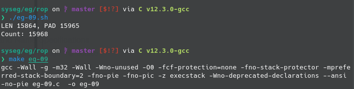
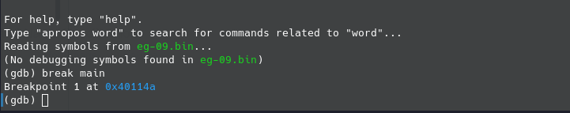
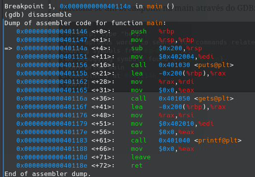
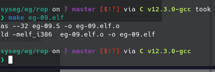
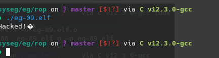

# Trabalho Projeto e Desenvolvimento de Software de Sistema

Guilherme Ramos Costa Paixão - 11796079

**2.**

**Passo a passo da execução do exploit:**

Compilação

Adiciona-se um breakpoint na main através do GDB:

Após rodar, o programa para na *main* e é feito um disassemble:

Em seguida, é criado o arquivo eg-09.elf:

E com o ELF criado, executando-o, temos a mensagem do exploit: "Hacked!".

**Explicando o exploit**

O shellcode usado explora vulnerabilidades de estouro de buffer para executar comandos maliciosos no sistema. No caso desse código específico (eg-09.S), o shellcode é projetado para realizar uma chamada ao sistema e escrever uma mensagem no stdout (saída padrão) antes de encerrar o programa.

O funcionamento do shellcode é o seguinte:

1. A função "_load_eip_in_eax" é uma "thunk function" usada para obter o valor do registrador %eip, que contém o endereço da próxima instrução a ser executada. Esse valor é obtido chamando a função "_load_eip_in_eax" e é armazenado no registrador %eax.

2. O valor do registrador %eax é ajustado para apontar para a string que será escrita na saída. Para isso, subtrai-se o comprimento da instrução anterior (5 bytes) e adiciona-se um deslocamento absoluto (0x2a), chegando assim ao endereço da string.

3. São usadas instruções "mov" para configurar os valores corretos nos registradores %eax, %ebx e %edx para realizar a chamada do sistema "write" (syscall 4) em um sistema Linux de 32 bits.

4. A interrupção de software "int $0x80" é utilizada para efetuar a chamada do sistema "write".

5. Após a chamada do sistema "write", outra chamada do sistema é feita para encerrar o programa usando a syscall "exit" (syscall 1).

6. A string que contém a mensagem a ser escrita ("Hacked!") é definida no final do código.

O script "eg-09.sh" é responsável por construir o payload do exploit, ou seja, gerar o arquivo "eg-09.in" que será injetado no programa "eg-09" para realizar o ataque. O funcionamento do script é o seguinte:

1. A linha "PAYLOAD=eg-09.bin" define o nome do arquivo do payload como "eg-09.bin".

2. A linha "LEN=$(cat $PAYLOAD | wc -c)" conta o número de caracteres no arquivo do payload e armazena esse valor em uma variável chamada "LEN".

3. A linha "OUTPUT=eg-09.in" define o nome do arquivo de saída como "eg-09.in".

4. A variável "count" é inicializada com o valor zero.

5. É executado um loop 100 vezes para adicionar instruções NOP (no-operation) ao arquivo de saída. Isso cria um "sled" de NOPs para a execução fluir até o código shell que será injetado posteriormente.

6. O conteúdo do arquivo do payload é adicionado ao arquivo de saída.

7. A variável "count" é atualizada para refletir o número de bytes adicionados ao arquivo de saída até o momento.

8. Outro loop é executado para adicionar instruções NOP adicionais até atingir um tamanho específico (516 bytes no total) para preencher o espaço restante no arquivo de saída.

9. É adicionado um conjunto específico de bytes (\x68\xcd\xff\xff) ao arquivo de saída para sobrescrever o endereço de retorno de uma função e redirecionar a execução para uma localização específica. Neste caso, o endereço de retorno é substituído pelo valor 0xffffcd68.

10. A variável "count" é atualizada novamente para refletir o número total de bytes no arquivo de saída.

**2-c.**

O exemplo não funciona fora do depurador devido a dois mecanismos de segurança implementados pelo tempo de execução (runtime): randomização do layout do espaço de endereços (ASLR) e o protetor de pilha (canary).

**Randomização do Layout do Espaço de Endereços (ASLR):**

O ASLR aleatoriamente altera a disposição dos componentes do programa na memória durante cada execução. Isso dificulta a previsão da localização exata das vulnerabilidades da memória, tornando mais difícil explorá-las. Dentro do depurador, essa aleatorização é frequentemente desativada para facilitar a depuração.

**Protetor de Pilha (Canary):**

O canary é um valor colocado na pilha de execução do programa para detectar ataques de estouro de buffer. Se houver uma tentativa de modificar esse valor, o programa pode encerrar-se ou tomar outras medidas para evitar a exploração do ataque. Fora do depurador, o protetor de pilha está ativo, tornando mais difícil ou impossível explorar vulnerabilidades de estouro de buffer e outros ataques de memória.